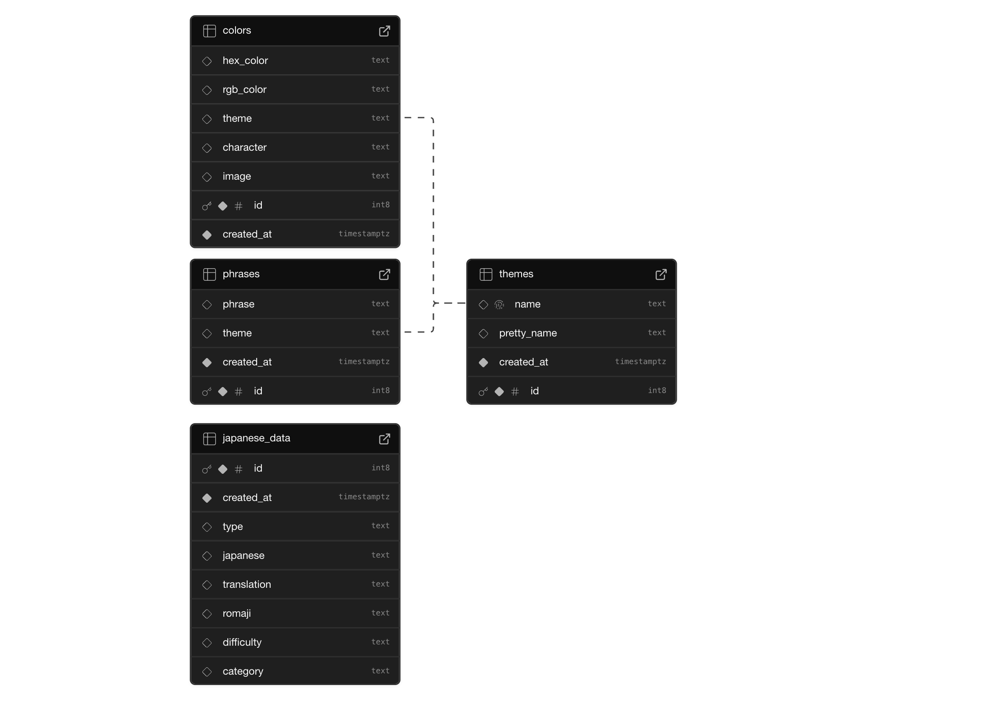

# 🌸 animetools.io

Welcome to **animetools.io** — a growing collection of anime-inspired tools, color palettes, datasets, and fun utilities for fans, designers, and developers! This project is open source and contributions are welcome.

---

## �️ Database Schema

This project uses [Supabase](https://supabase.com/) for its backend. Here is the current schema:



> If you want to contribute or run the project locally with full functionality, you will need a Supabase project with the following tables and relationships.

---

## 🔑 Environment Variables

Create a `.env` file in the root of the project and add the following variables:

```env
SUPABASE_URL=XXXXX
SUPABASE_KEY=XXXXX
MAL_CLIENT_ID=XXXXX
MAL_CLIENT_SECRET=XXXXX
```

---

## �🚀 Features

- Beautiful anime color palettes
- Anime datasets (for learning, fun, and projects)
- Password generator with anime themes
- Japanese learning mini-games
- More tools and datasets coming soon!

---

## 🛠️ Getting Started

1. **Clone the repo:**
   ```bash
   git clone https://github.com/FlameyFox/animetools.git
   cd animetools
   ```

2. **Install dependencies:**
   ```bash
   # With npm
   npm install
   # Or with yarn
   yarn install
   # Or with pnpm
   pnpm install
   ```

3. **Start the development server:**
   ```bash
   # With npm
   npm run dev
   # Or with yarn
   yarn dev
   # Or with pnpm
   pnpm run dev
   ```
   The app will be running at [http://localhost:3000](http://localhost:3000)

---

## 🏗️ Production

To build for production:

```bash
# With npm
npm run build
# Or with yarn
yarn build
# Or with pnpm
pnpm run build
```

To preview the production build locally:

```bash
# With npm
npm run preview
# Or with yarn
yarn preview
# Or with pnpm
pnpm run preview
```

For more info, see the [Nuxt deployment docs](https://nuxt.com/docs/getting-started/deployment).


---

## ⭐️ Support

If you like this project, please consider [starring the repo](https://github.com/FlameyFox/animetools) — it helps a lot and motivates further development!

---

## 📄 License

MIT